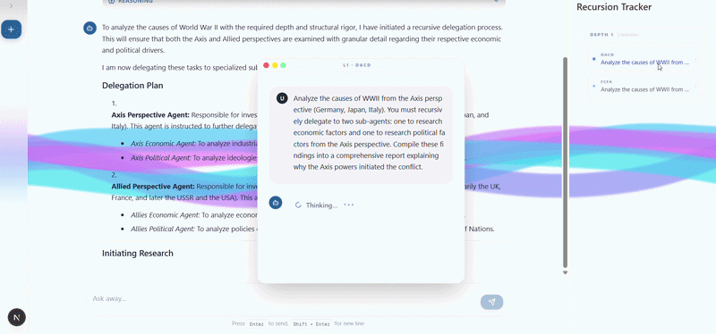

[](https://opensource.org/licenses/MIT)

# cascaide-ts 

Fullstack agent runtime and AI orchestration framework in typescript designed to run anywhere JS/TS can. It was originally built for web applications but works equally well for headless/CLI AI agents and workflows in javascript runtimes.

What it really is is a distributed, observable, durable graph executor. The first split just happens to be client/server, hence full stack.

To learn more about how to use Cascaide, check out the [docs](https://www.cascaide-ts.com/docs/introduction). Cascaide was built with developer experience at its core. As you read through the docs, you will see that you can accomplish a surprising amount of work with plain programmatic control. Complexity arises from composing simple primitives and the abstractions will feel familiar.




## Full Stack Quickstart

Get started quickly by building a full-stack cascaide application using the create-cascaide-app CLI:

```bash
npx create-cascaide-app@latest
```

The CLI sets up a full stack AI application with 3 agents 

- ReAct Agent with search capabilities
- Hotel Booking Agent(Supervisor) with two sub agents and two HITL steps
- Recursive ReAct Agent with search capabilities that can recursively invoke itself to handle complex tasks. Each fresh instance at every recursion depth is trackable via mini chat windows

CLI currently gives you apps in

- NextJS
- React + Hono
- React + Fastify
- React + Express

For both Cascaide and Cascaide Lite (more below).


## Why Use Cascaide 

Here is why you should use Cascaide:


- **Learn Fast** - Simple, powerful abstractions you can learn over lunch. 
- **Zero Orchestration Cost** -  No hosted runtime required. Nothing extra to pay for.
- **Build UI First** - Model UI as nodes in your agent graph.
- **Build Fast** - Single codebase, no context switching.
- **Debug Easily** - Debugging and timetravel out of the box.
- **Deploy Anywhere** - Deploy like any other application, no caveats.
- **Stay Light** - 23kb gzipped core, 46kb with all adapters and helpers. Code you can read.
- **UX Possibilities** - Build imaginative applications, as easy as writing React.
- **Web Stack Agnostic** - Drop into whatever you're already working with.
- **Easily Extensible** - Extend for custom capabilities via familiar middleware patterns.
- **Compliance** - All agent traces live on your database under your control.

*v0.5.0 ships with adapters for Next.js, React + Express, Hono, and Fastify. Wider support coming soon.

## Cascaide vs Cascaide Lite 

Cascaide comes with a non durable lite mode. Only app set up, and what you send from frontend changes, agent code remains constant.

| Feature | **Cascaide** | **Cascaide Lite** |
| :--- | :--- | :--- |
| **Description** | The durable, full version requiring a Postgres DB for data persistence. | Non-durable, lightweight version that is easier to set up. |
| **Best For** | Commercial applications and production environments. | Internal tools, microservices, and hobby projects. |
| **Durability** | High (Robust checkpointing). | Low (Non-durable). |
| **Audit Logs** | Full audit trails provided. | No full audit logs. |
| **Data Handling** | Supports filtered conversation traces on the frontend. | Requires wiring full histories from the frontend; surfaces full agent traces. |
| **Use Case** | Use if you need a robust, commercial-grade backend. | Use if you want quick setup and are comfortable with frontend-managed history. |


## Acknowledgements

- Redux and RTK : We use it extensively under the hood. Massive respect for the team.
> "The good news is that this means Redux can be used in many different ways. The bad news is that there are no helpers to make any of your code easier to write." 
> --  Redux Toolkit documentation

- DBOS : We use their idea of durability through checkpointing in a database to achieve persistence.
- Pocketflow: The project that made me think maybe my idea isn't entirely cuckoo.